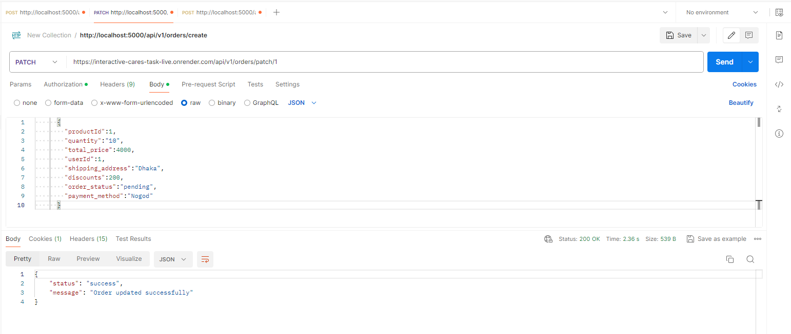

# Node With Sequelize ORM

## Technology used

This repository uses a number libraries to work:

- [NodeJs]
- [ExpressJs]
- [Cors]
- [Sequelize]
- [MySQL]


# Installation
 Follow these steps to install the application.
1. Clone the Repository
```
git clone https://github.com/mostofa-s-cse/Task-Backend-Interactive-Cares.git
```
2. Go to project directory

```
cd Task-Backend-Interactive-Cares
```

3. Install packages with npm

```
npm i
```
4. Create database .env

```
DB_NAME=node_db
DB_USER=root
DB_PASSWORD=
```
5. Start the local server and browser to your app.
This command will start the development server
```
npm run dev
```

# Api
1. Create User, Post Api
http://localhost:5000/api/v1/user/signup


2. Login User, Post Api 
http://localhost:5000/api/v1/user/login


3. Create Oders Post Api with Bearer Token.
http://localhost:5000/api/v1/orders/create
 

4. GetAll Oders Get Api with Bearer Token.
http://localhost:5000/api/v1/orders


5. GetSingle Oders Get Api with Bearer Token.
http://localhost:5000/api/v1/orders/:id


6. Update Oders put Api with Bearer Token.
http://localhost:5000/api/v1/orders/update/:id


7. Update Oders patch Api with Bearer Token.
http://localhost:5000/api/v1/orders/update/:id


8. Delete Oders delete Api with Bearer Token.
http://localhost:5000/api/v1/orders/delete/:id

