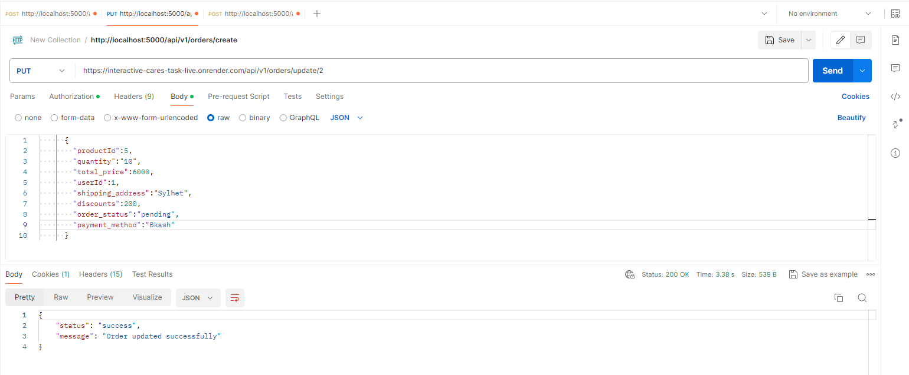

# Node With Sequelize ORM

## Technology used

This repository uses a number libraries to work:

- [NodeJs]
- [ExpressJs]
- [Cors]
- [Sequelize]
- [MySQL]

# Api
1. Create User, Post Api
https://interactive-cares-task-live.onrender.com/api/v1/user/signup

2. Login User, Post Api 
https://interactive-cares-task-live.onrender.com/api/v1/user/login

3. Create Oders Post Api.
https://interactive-cares-task-live.onrender.com/api/v1/orders/create

4. GetAll Oders Get Api.
https://interactive-cares-task-live.onrender.com/api/v1/orders

5. GetSingle Oders Get Api.
https://interactive-cares-task-live.onrender.com/api/v1/orders/2

6. Update Oders put Api.
https://interactive-cares-task-live.onrender.com/api/v1/orders/update/2

7. Update Oders patch Api.
https://interactive-cares-task-live.onrender.com/api/v1/orders/patch/1

8. Delete Oders delete Api.
https://interactive-cares-task-live.onrender.com/api/v1/orders/delete/2

